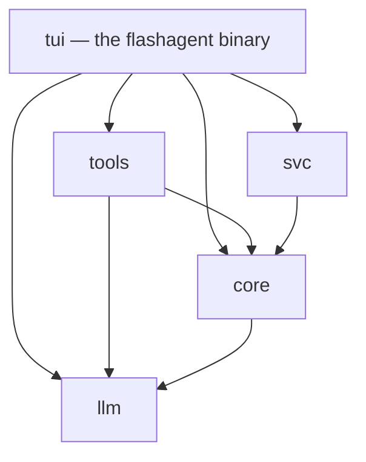
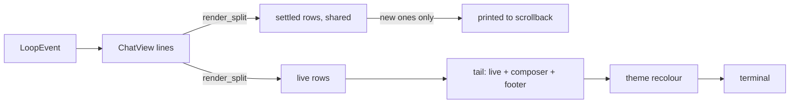

# Architecture

What exists today. Plans live in [ROADMAP.md](ROADMAP.md).

## Process

One process. `flashagent` (crate `flashagent-tui`) runs the terminal UI, the
agent loop, the tools and the permission layer together. There is no
background service and no IPC.

## Crates

| Crate | What it holds |
|---|---|
| `core` | Agent loop and its events, permission modes and approval gating, subagents, memory (rule files and the per-fact store), system prompt, config, auto-effort learning, tool-calling check. |
| `llm` | One backend: an OpenAI-compatible streaming client. Thinking-preset discovery, text tool-call parsing, JSON repair, token estimates. |
| `tools` | Built-in tools (files, patching, shell, search, git, memory, web), the MCP client and marketplace, subagent spawning. |
| `tui` | The terminal UI: chat view, composer, menus, settings, setup wizard, `/goal`, image attachments, what's-new screen. |
| `svc` | The self-updater. |

`core` does not depend on `tools` or `tui`; the loop talks to tools and to
the model through traits (`ToolExec`, `LlmSource`), which is also how the
tests drive it with mocks.



## One turn

```mermaid
sequenceDiagram
    actor User
    participant TUI as tui (App)
    participant Loop as core::AgentLoop
    participant Model as llm::OpenAiCompat
    participant Gate as core::PermissionedTools
    participant Tools as tools::BuiltinTools

    User->>TUI: Enter
    TUI->>Loop: spawn the turn (history, budgets, cancel token)
    loop until the model answers without a tool call
        Loop->>Model: stream the history
        Model-->>Loop: text, reasoning, tool calls
        Loop-->>TUI: LoopEvent per delta
        Loop->>Gate: each tool call
        alt the mode allows it
            Gate->>Tools: run
        else it needs a person
            Gate-->>TUI: approval card
            User->>TUI: allow / always / deny
            TUI->>Gate: the answer
            Gate->>Tools: run, or refuse
        end
        Tools-->>Loop: result, fed back to the model
    end
    Loop-->>TUI: Done
    TUI->>TUI: save the session
```

The loop runs on its own task. The UI never waits on it: events arrive
through a channel and are drawn when they come. Enter while a turn runs
sends a steering message down another channel into the same turn.

## Agent loop

`core::loop_` streams a turn from the model, collects tool calls (native, or
parsed out of text for models that write them inline), runs each call
through the permission layer, feeds results back, and repeats until the
model answers without a call or a budget runs out. Budgets: steps, total
tokens, generated tokens, wall-clock time. Every event (text, reasoning,
tool start and finish, usage) is emitted for the UI.

Every tool call the model makes gets a result, including when the user
cancels, because strict servers reject a history with an unanswered call.

## Permissions

Four modes: Planning (read-only; shell commands on a short list of programs
that only read run, everything else is refused), Manual (ask before anything
that is not a read), Accept Edits (file changes allowed, shell asks), Accept
All. Shell approvals can be remembered per command prefix, and a prefix never
covers a different subcommand: approving `npm test` does not approve
`npm publish`. A short blacklist of dangerous commands (recursive force
deletes, `sudo`, force pushes, hard resets, ...) still asks in Accept All and
is refused outright during `/goal`, where nobody is there to answer. A
declined call is returned to the model as an error it must not retry. The
mode the user is in is saved as the one to start in next time.

## Model backend

Anything that speaks the OpenAI chat-completions API: LM Studio, Ollama,
llama.cpp, vLLM, OpenRouter. What a model supports (context window, tool
use, vision, thinking presets) is read from the server; the thinking
profile is re-read when the model changes.

## Memory

- Rule files: `MEMORY.md`, `CLAUDE.md`, `AGENTS.md` and `.agents/rules/` in
  the project, and `~/.flashagent/` globally, injected into the prompt.
- Remembered facts: one file per fact under `memory/`, indexed by
  `MEMORY.md`. Facts about the user are global, facts about the code stay
  with the project. Writes are refused during `/goal`.

## Terminal UI

The screen is drawn by `render.rs` as print-and-forget: rows of the
transcript that can no longer change are printed once into the terminal's
own scrollback, and only the "tail" is redrawn on each frame. The tail is
the turn in progress, the composer and the footer.



- `ChatView::render_split` keeps the settled rows in a cache shared through
  an `Arc`. A frame reads again only from the turn the settled boundary
  falls in, so its cost barely grows with the length of the session (see
  [docs/numbers.md](docs/numbers.md)).
- Every row is measured in display cells and clipped or wrapped to the
  width. A row wider than the terminal would wrap, the tail would take more
  rows than counted, and the next redraw would land in the wrong place.
- Themes are applied to the finished frame by rewriting its 24-bit colour
  sequences, so the drawing code has one palette.
- Motion (Settings → Animations) goes through `anim::enabled()`. Off, only
  the spinner moves.
- The composer is `composer::Composer`: text and a cursor that steps over
  grapheme clusters. It folds its text into rows for the box, and the box
  grows up to a third of the screen, then scrolls around the cursor.

## Sessions

A conversation is saved after each turn and on exit, to
`~/.flashagent/sessions/<id>.json`.

- The id is `session_<unix seconds>_<process id>`. Two instances running at
  once never share a process id, so they never share a session file.
- A save writes a temporary file beside the target and renames it over
  the target. A crash leaves the old session or the new one, never half.
- A failed save is shown on screen and retried after the next turn. On
  exit there is no next turn, so the conversation goes to the temporary
  folder instead, and the message says where.
- A `--resume` whose file cannot be read starts a new session under a new
  id. The damaged file is left as it is.

## Storage

Plain files under `~/.flashagent/`: `config.json`, `sessions/*.json`,
`snapshots/<session>/` (file copies for `/rewind`), `prompt_history.jsonl`
(what was sent, for ↑ and Ctrl+F; kept only while sessions are saved),
`memory/` and `MEMORY.md`, `rules/`, `skills/`, `mcp.json`, `effort.json`,
`image-costs.json`, `prefill_cache.json`. A project can add its own
`.mcp.json`, `.agents/rules/` and `.agents/skills/`.

## Updates

GitHub Releases, `beta` and `stable` channels. Version formats (`b287`,
`v1.0.0+b290`), how they compare, and how to release are in
[VERSIONING.md](VERSIONING.md). The updater downloads the
release asset, checks it against `SHA256SUMS`, and replaces the binary; the
new version runs on the next start.

## Tests

- Unit tests next to the code.
- Loop tests against a mock model.
- Render tests that assert no row overflows the terminal width.
- `crates/tools/tests/every_tool.rs` calls every built-in tool for real in a
  temporary project.
- `crates/tui/tests/scenarios.rs` runs the real binary in a pseudo-terminal
  (`portable-pty` + `vt100`) against a scripted model server, types into
  it, and reads the screen.

CI runs `cargo test --workspace` and `cargo clippy --all-targets
-D warnings` on Linux, Windows and macOS, and the same run gates every
release. The tests that need the internet run nightly
(`.github/workflows/web-tools.yml`).
