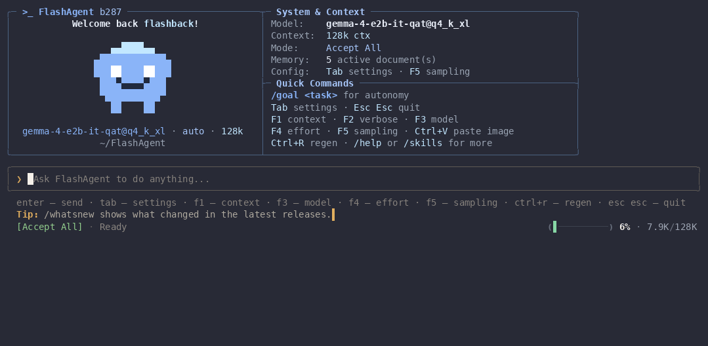
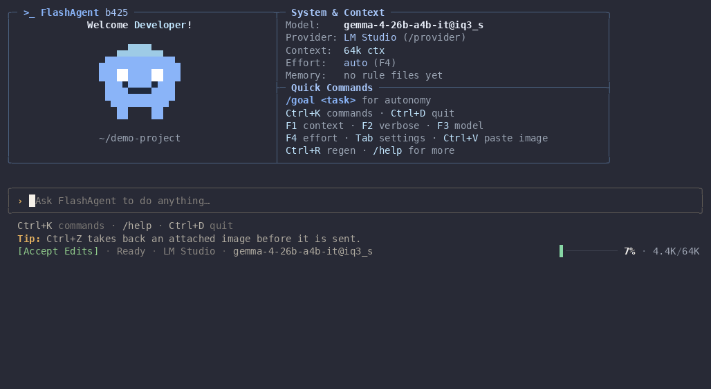
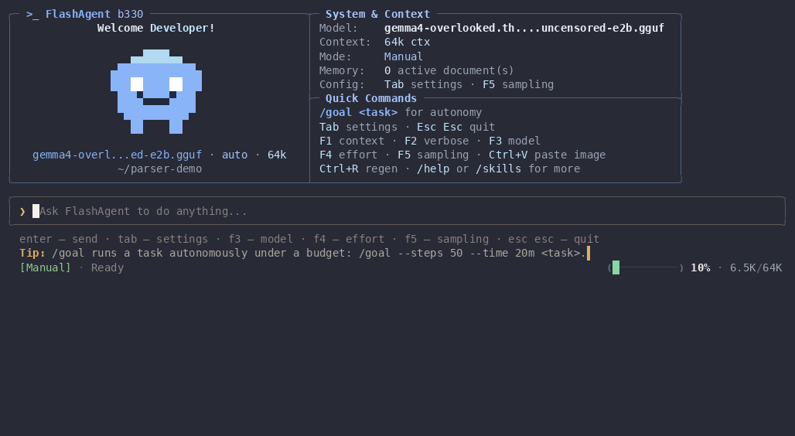
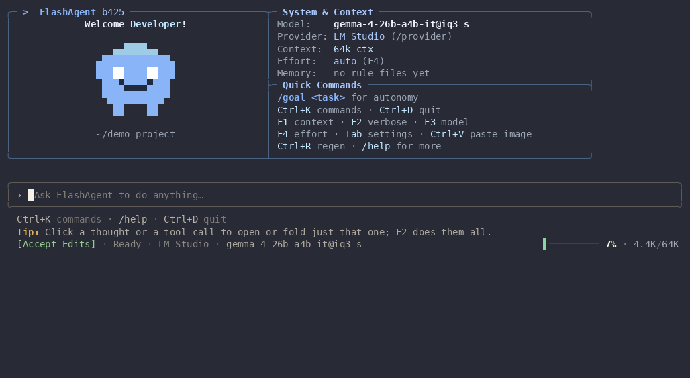
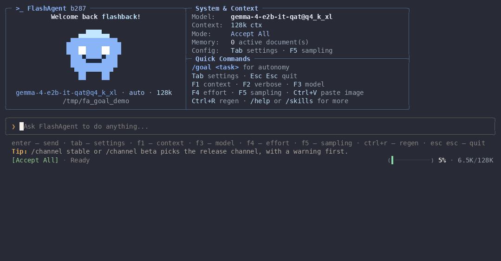
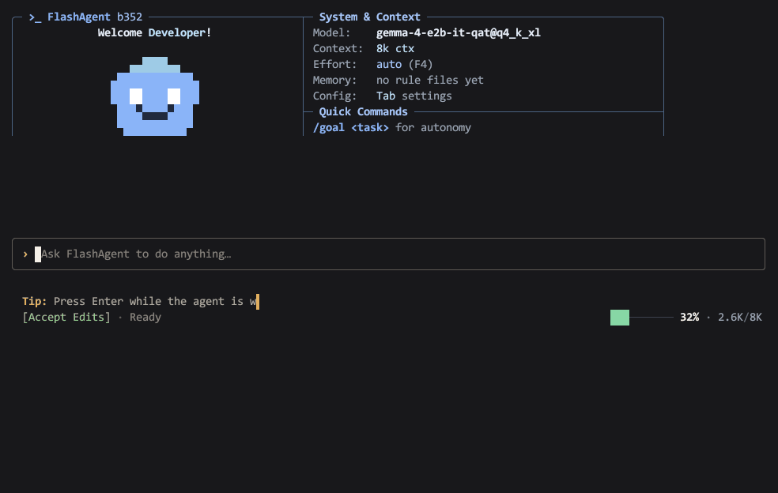

<div align="center">

<a href="https://github.com/flashback7766/FlashAgent">
  
</a>

<br/>

### A fast, local-first AI coding agent for your terminal — one native Rust binary, your models, your machine.

[](https://github.com/flashback7766/FlashAgent/actions/workflows/ci.yml)
[](https://github.com/flashback7766/FlashAgent/releases)
[](https://www.rust-lang.org)
[](LICENSE)
[](https://github.com/flashback7766/FlashAgent/releases)
[](https://github.com/flashback7766/FlashAgent/discussions)

**~11 MB of RAM idle · single ~19 MB binary · no Node, no Python, no Electron · zero telemetry**

<br/>



</div>

> **Status:** Beta b250 — actively developed by a solo maintainer. See the [changelog](CHANGELOG.md) and the [roadmap](ROADMAP.md).

---

## Why FlashAgent

- **Built for local models.** Point it at LM Studio, Ollama, llama.cpp or vLLM and it discovers the loaded model, its context window and its reasoning presets on its own. Cloud endpoints (OpenRouter, anything OpenAI-compatible) work too.
- **Tool calling that does not depend on luck.** Native tool calls, plus a recovery parser for models that write calls as text (`<tool_call>`, `[TOOL_CALLS]`, bare JSON) — common with small local models. Arguments are JSON-repaired before they reach a tool. And you do not have to guess whether your model is up to it: `flashagent --tool-test` [scores it in seconds](docs/tool-calling.md).
- **You stay in control.** Four permission modes, an approval card that shows the exact command, diff or MCP arguments, and "Always" rules that stay narrow: allowing `cargo test` never allows `cargo publish`.
- **Steer while it works.** Type while the model is streaming and press <kbd>Enter</kbd>: your guidance lands at the next safe point without breaking the tool-call protocol. <kbd>Esc</kbd> interrupts cleanly — pending tool calls are closed out and partial output is kept, so the next prompt just continues.
- **Tiny and instant.** One self-contained binary (only libc underneath), ~11 MB resident when idle, prints its version in ~5 ms. Nothing to install alongside it.

<table>
<tr>
<td width="50%"><br>
<sub><b>Mid-flight steering</b> — redirect a running turn without losing it.</sub></td>
<td width="50%"><br>
<sub><b>Tools & approvals</b> — every write, patch and shell command stops at a card naming the exact target: Allow, Always or Deny.</sub></td>
</tr>
<tr>
<td colspan="2"><br>
<sub><b>Non-blocking menus</b> — switch model (<kbd>F3</kbd>), thinking effort (<kbd>F4</kbd>) or sampling (<kbd>F5</kbd>) while tokens keep streaming.</sub></td>
</tr>
</table>

<sub>Every recording on this page is a real session against a local model — Gemma 4 E2B in LM Studio, 64k context — so the timings and token counts in the status line are the ones it produced. Playback is sped up; nothing else is edited.</sub>

---

## Will your model actually drive tools?

An agent is only as good as the model's willingness to call a tool instead of
describing one — and that failure is quiet, so FlashAgent ships the check:

```bash
flashagent --tool-test               # the model you have configured
flashagent --tool-test --all-models  # every chat model your server lists
```

Eight scenarios, each one something the loop does on real work. Measured here
on one machine, LM Studio, one model resident at a time:

| Model | Score | Time | Where it fell down |
| :--- | :--- | :--- | :--- |
| `qwen3.6-35b-a3b-mtp@iq3_xxs` | **8/8** | 48s | — |
| `gemma-4-e4b-it@iq4_xs` | 7/8 | 21s | recovering from a failed call |
| `gemma4-overlooked.thinker.uncensored-e2b` | 7/8 | 8s | recovering from a failed call |
| `gemma-4-e2b-it-qat@q4_k_xl` | 6/8 | 9s | recovering from a failed call; two files in one turn |

The interesting number is not the score, it is *which* scenario fails. Three of
these four, handed a tool result that says `error: no such file: src/confg.rs
(did you mean src/config.rs?)`, explain the problem in prose instead of calling
the tool again with the corrected path. Tools fail constantly in real work — a
wrong path, a build error, a missing dependency — and a model that turns each
one into a paragraph makes you the one driving.

[Method, raw results, and how to run it on your own models →](docs/tool-calling.md)

---

## Quick start

### 1. Install

```bash
# Linux & macOS — latest beta
curl -fsSL https://raw.githubusercontent.com/flashback7766/FlashAgent/main/install.sh | FLASHAGENT_CHANNEL=beta bash
```

```powershell
# Windows (PowerShell)
irm https://raw.githubusercontent.com/flashback7766/FlashAgent/main/install.ps1 | iex
```

Packages for Arch (`pacman -U`), Debian/Ubuntu (`dpkg -i`), Void, AppImage, macOS and Windows are attached to every [release](https://github.com/flashback7766/FlashAgent/releases), together with a `SHA256SUMS` file.

<details>
<summary>Build from source</summary>

Requires [Rust 1.85+](https://rustup.rs):

```bash
git clone https://github.com/flashback7766/FlashAgent.git
cd FlashAgent
cargo build --release
./target/release/flashagent
```
</details>

### 2. Connect a model

Start your server, then run `flashagent` in your project directory. The first launch opens a setup wizard; `flashagent --setup` reopens it later.

| Server | Endpoint | Notes |
| :--- | :--- | :--- |
| **LM Studio** (default) | `http://localhost:1234/v1` | Loaded model, context size and reasoning presets are auto-discovered |
| **Ollama** | `http://localhost:11434/v1` | `ollama run qwen2.5-coder:32b` |
| **llama.cpp** | `http://localhost:8080/v1` | `llama-server -m model.gguf --jinja` |
| **vLLM** | `http://localhost:8000/v1` | |
| **OpenRouter / any OpenAI-compatible API** | e.g. `https://openrouter.ai/api/v1` | API key via the wizard or `FLASHAGENT_API_KEY` |

```bash
flashagent --url http://localhost:11434/v1 --model qwen2.5-coder:32b   # one-off override
```

---

## What it can do

**Tools** — `read_file`, `write_file`, `edit_file` (exact replacements, tolerant of CRLF and quote styles), `patch_file` (unified diffs), `list_dir`, `glob`, `grep` (parallel), `outline_file`, `git_status`, `git_diff`, `run_shell` (foreground with timeout or background tasks you can poll and kill; timeouts kill the whole process tree), `env_info`, `ask_user` (interactive choices in the composer), memory tools, `spawn_agent` (subagents that inherit your permissions), and opt-in `web_fetch` / `web_search`. The toolset shrinks automatically for small context windows.

**Permission modes** — cycle with <kbd>Shift</kbd>+<kbd>Tab</kbd> or `/mode`:

| Mode | File edits | Shell | External (MCP) tools |
| :--- | :--- | :--- | :--- |
| **Planning** | refused | refused (unless allowed by a rule) | only tools you marked `read_only` |
| **Manual** | ask, with diff | ask | ask (`read_only` ones run) |
| **Accept Edits** (default) | run | ask | ask (`read_only` ones run) |
| **Accept All** | run | run | run |

Reads are always allowed. Approval cards offer **Allow**, **Always** and **Deny**; "Always" on a shell command stores a narrow per-command rule for the session.

**MCP** — add servers in `.mcp.json` (project) or `~/.flashagent/mcp.json` (global), browse a small vetted marketplace with `/mcp market`, install with `/mcp add <id>`, test with `/mcp test <name>`. Mark a server or individual tools `read_only` to skip approval for them — only your config can do that; a server's own claims (tool names, `readOnlyHint`) never bypass an approval card.

```json
{
  "mcpServers": {
    "sqlite": { "command": "uvx", "args": ["mcp-server-sqlite", "--db-path", "data.db"], "read_only_tools": ["read_query", "list_tables"] }
  }
}
```

**Memory & rules** — `MEMORY.md`, `CLAUDE.md`, `AGENTS.md`, `.cursorrules`, `.agents/rules/*.md` and `~/.flashagent/MEMORY.md` are picked up automatically and injected within a token budget (whole files when they fit, outlines when they do not).

**Sessions** — conversations are saved on exit; resume with `flashagent --resume <session_id>`. `/compact` summarises older turns to free context, and it happens automatically near the limit.

**Autonomous mode (`/goal [--steps N] [--time 30m] [--tokens 200k] <task>`)** — runs the task end to end in Accept All mode with maximum reasoning effort and no questions, under a budget (default: 250 steps and one hour; `--tokens` counts generated tokens only). The status line shows the burn-down live, and the run ends with a factual report card — steps, generated tokens, elapsed, files created and edited, shell commands that failed, and whether a budget cut the run short — built from what the loop did, not from what the model says it did. Your previous permission mode and effort are restored afterwards. Filesystem snapshots and milestone commits are on the [roadmap](ROADMAP.md).



<sub>Here a four-step budget cuts the run short and the card says so — <b>INCOMPLETE</b>, one file created, no shell commands — while the model's own closing summary sits above it.</sub>

**Updates** — <kbd>Ctrl</kbd>+<kbd>U</kbd> in the app, `flashagent --update`, or automatic background checks. A manual update checks, downloads and installs in one press and shows each stage; a background one stays silent. Downloads are verified against the release checksums; `--channel stable|beta` or `/channel` switches channels.



---

## Keybindings

| Key | Action |
| :--- | :--- |
| <kbd>Enter</kbd> | Send prompt · while the model works: steer it |
| <kbd>Esc</kbd> | Close menu / dismiss suggestion / interrupt the running turn · on an empty prompt: quit |
| <kbd>Ctrl</kbd>+<kbd>C</kbd> | Interrupt the running turn · otherwise copy input or last answer · twice on an empty prompt: quit |
| <kbd>Tab</kbd> | Settings (empty prompt) · complete a `/command` |
| <kbd>Shift</kbd>+<kbd>Tab</kbd> | Cycle permission mode |
| <kbd>F1</kbd> | Context window breakdown |
| <kbd>F2</kbd> | Verbose mode: collapsed → last turn → everything |
| <kbd>F3</kbd> / <kbd>Alt</kbd>+<kbd>M</kbd> | Model picker with fuzzy search |
| <kbd>F4</kbd> / <kbd>Ctrl</kbd>+<kbd>T</kbd> | Thinking effort presets reported by the model |
| <kbd>F5</kbd> | Sampling parameters and presets |
| <kbd>Ctrl</kbd>+<kbd>O</kbd> / <kbd>Alt</kbd>+<kbd>O</kbd> | Expand last / all reasoning blocks |
| <kbd>Ctrl</kbd>+<kbd>R</kbd> | Regenerate the last answer |
| <kbd>Ctrl</kbd>+<kbd>E</kbd> | Compose the prompt in your editor |
| <kbd>Ctrl</kbd>+<kbd>U</kbd> | Install a pending update |
| <kbd>→</kbd> | Accept the suggested follow-up prompt |
| <kbd>PgUp</kbd> / <kbd>PgDn</kbd> | Scroll the conversation |

Type `/help` for every slash command: `/goal`, `/mode`, `/model`, `/effort`, `/sampling`, `/context`, `/compact`, `/mcp`, `/skills`, `/diff`, `/commit`, `/export`, `/update`, `/channel`, `/exit` and more.

---

## Architecture

A Cargo workspace; the terminal client runs the whole stack in-process today.

```
crates/core    agent loop, steering, permissions, subagents, memory, system prompt
crates/llm     OpenAI-compatible streaming, reasoning-preset discovery, text tool-call parser, JSON repair
crates/tools   built-in tools, sandboxed shell, patching, MCP client/manager/marketplace
crates/tui     crossterm terminal UI (the product today)
crates/svc     self-updater (future home of the background service)
crates/data    SQLite + FTS5 store (not yet used by the TUI; sessions are JSON files)
crates/proto   IPC contract (reserved for the UI ⇄ service split)
crates/ui      native wgpu renderer prototype (Track B, planned for v2)
```

The split into a background service plus native GPU UI, IPC and the SQLite-backed session sidebar are planned work — see [ARCHITECTURE.md](ARCHITECTURE.md) and [ROADMAP.md](ROADMAP.md).

```bash
cargo test --workspace
cargo clippy --workspace --all-targets -- -D warnings
```

---

## Contributing

Contributions are very welcome — FlashAgent is a solo project and every bug report helps.

1. Read [PHILOSOPHY.md](PHILOSOPHY.md) for the design principles.
2. Read [CONTRIBUTING.md](CONTRIBUTING.md) for the workflow.
3. Pick something from [ROADMAP.md](ROADMAP.md) or open an issue.

If you want the most stable experience, use the `stable` channel once `v1.0.0` ships (`flashagent --channel stable`); until then everything is beta and bugs are expected.

## License

[MIT](LICENSE)
